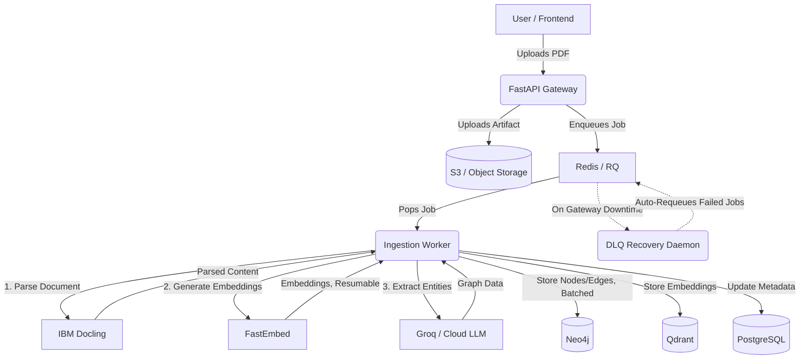
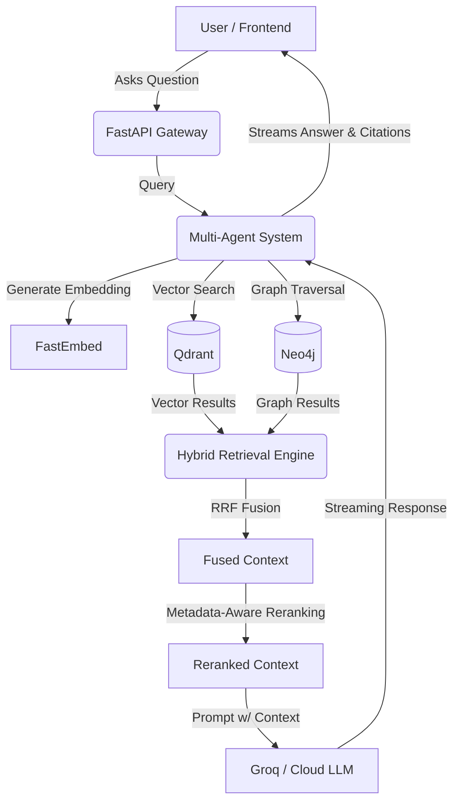

<div align="center">


# Seekr

> **AI-Powered Industrial Knowledge Intelligence Platform**

**ET AI Hackathon 2026 — Problem Statement 8**
*AI for Industrial Knowledge Intelligence: Unified Asset & Operations Brain*

**Live Demo:** [https://seekr-search-ai.vercel.app](https://seekr-search-ai.vercel.app)

</div>

---

## The Problem

Industrial organizations drown in scattered technical documents — spec sheets, maintenance logs, compliance standards, P&IDs. Critical knowledge is trapped in PDFs, siloed across departments, and lost when experienced engineers retire.

**No single document contains the full picture.** Finding the answer requires connecting facts across dozens of sources — a task that takes human experts hours and still misses critical links.

## Our Solution

**Seekr** turns scattered industrial documents into a unified, searchable knowledge graph and talks to them using a multi-agent AI copilot with verifiable citations.

Unlike basic RAG systems that retrieve text, **Seekr retrieves knowledge** — connecting facts across documents that no individual search could surface alone.

---

## Key Differentiators

| Capability | What Seekr Does | Why It Matters |
|-----------|----------------|----------------|
| **Knowledge Graph Construction** | Automatically extracts entities, relationships, and specs from uploaded documents into Neo4j | Builds a connected industrial brain, not just a document index |
| **Hybrid Retrieval (RRF + Reranking)** | Combines dense vector search, graph traversal, and lexical matching with metadata-aware reranking | Surfaces the most relevant context regardless of query type |
| **Adaptive Graph Traversal** | Level-synchronous, best-first expansion with batched Neo4j queries and configurable decay/pruning | O(depth) round-trips instead of O(nodes) — scales to production graph sizes |
| **Multi-Agent Reasoning** | LangGraph Supervisor routes to specialist workers (Asset, Diagnose, Comply) | Deep domain reasoning without prompt bloat |
| **Self-Healing Ingestion** | DLQ recovery daemon + exponential backoff automatically requeues failed jobs | Zero manual intervention when LLM gateways go down |
| **Verifiable Citations** | Every answer cites specific documents, pages, and sections | Auditable answers that engineers can trust |
| **Audit Trail** | Every query and agent invocation is logged for compliance | Complete accountability for industrial decision-making |

---

## Architecture

```text
        Next.js (Frontend)
               ↓
   FastAPI (API Gateway)
               ↓
    RQ Workers (Async Queue + DLQ Recovery)
               ↓
     Hybrid Retrieval Engine (RRF + Reranking)
               ↓
   Multi-Agent Reasoning (LangGraph)
               ↓
 +-----------------------------------+
 | Qdrant | Neo4j | Postgres | S3    |
 +-----------------------------------+
               ↓
    Groq / Cloud LLM (High-Speed Inference)
```

### Ingestion Pipeline



### Query Retrieval Pipeline



---

## Features

- **Layout-aware PDF Parsing** — IBM Docling extracts text, tables, and headings with structural awareness
- **Hybrid Retrieval** — Dense + Graph + Lexical pathways with Reciprocal Rank Fusion
- **Metadata-Aware Reranking** — Surfaces primary sources over secondary references using structural signals
- **Knowledge Graph Construction** — Open, domain-adaptive entity/relationship extraction into Neo4j
- **Multi-Agent Reasoning** — LangGraph Supervisor with specialist workers (Asset, Diagnose, Comply)
- **Streaming Responses** — Robust SSE with agent tracing, reasoning steps, and tool executions
- **Source Citations** — Every answer includes verifiable document citations with page numbers
- **Self-Healing Queue** — Automatic Dead Letter Queue recovery with exponential backoff
- **Resumable Ingestion** — Embedding jobs recover cleanly from partial failure
- **S3-Compatible Storage** — Production object storage with local-disk fallback for development
- **Audit Trail** — Compliance-ready logging of all queries and agent invocations
- **Docker Deployment** — Full `docker compose up` from clean clone

---

## Tech Stack

| Layer          | Technology         |
| -------------- | ------------------ |
| **Frontend**   | Next.js 16, React, TypeScript |
| **Backend**    | FastAPI, Python 3.11+ |
| **Vector DB**  | Qdrant             |
| **Graph DB**   | Neo4j              |
| **Metadata**   | PostgreSQL 15      |
| **Object Storage** | S3-Compatible (boto3) |
| **Queue**      | Redis + RQ (with DLQ recovery) |
| **AI Inference** | Groq / Any OpenAI-Compatible API |
| **Parsing**    | IBM Docling        |
| **Embeddings** | FastEmbed (BAAI/bge-base-en-v1.5) |
| **Agents**     | LangGraph          |
| **Deployment** | Docker, Render, Vercel |

---

## Repository Structure

```text
seekr/
├── backend/
│   ├── fabric_api/        # FastAPI application layer + DLQ Recovery
│   ├── ingestion_worker/  # P1: Parsing, embedding, and KG extraction
│   ├── app/
│   │   ├── retrieval/     # P2: Hybrid Retrieval (Dense, Lexical, Graph) + Reranking
│   │   ├── agents/        # P3: LangGraph Multi-Agent System
│   │   ├── api/           # API route handlers
│   │   └── schemas/       # Pydantic request/response models
│   └── shared/            # Config, DB clients, security, storage, audit
├── frontend/              # Next.js UI (graph explorer, copilot, entity pages)
├── scripts/               # Deployment and utility scripts
└── docker-compose.yml     # Full application stack
```

### Where to Look
- **`backend/app/retrieval/`** → Hybrid Retrieval Engine, RRF Fusion, and Reranking
- **`backend/app/agents/`** → LangGraph Multi-Agent System (Supervisor → Workers)
- **`backend/ingestion_worker/`** → Knowledge Graph Construction Pipeline
- **`backend/fabric_api/dlq_recovery.py`** → Self-Healing Queue Recovery
- **`backend/shared/audit.py`** → Compliance Audit Trail

---

## Quick Start

### Prerequisites
- Docker & Docker Compose
- Node.js 20+
- Python 3.11+ with [uv](https://github.com/astral-sh/uv)

### Option 1: Docker (Full Stack)

```bash
# Clone and start everything
git clone https://github.com/suparnagrawal/seekr.git
cd seekr
cp backend/.env.example backend/.env  # Configure your API keys
docker compose up -d
```

Visit `http://localhost:3000` to access Seekr.

### Option 2: Local Development

```bash
# 1. Infrastructure
docker compose up postgres redis qdrant neo4j -d

# 2. Backend
cd backend
cp .env.example .env       # Configure your API keys
uv venv && source .venv/bin/activate
uv pip install -e ".[dev]"
alembic upgrade head
uv run uvicorn backend.fabric_api.main:app --reload --port 8000

# 3. Ingestion Worker (separate terminal)
cd backend
source .venv/bin/activate
uv run python -m backend.ingestion_worker.main

# 4. Frontend (separate terminal)
cd frontend
cp .env.example .env
npm install && npm run dev
```

---

## Environment Variables

### Backend (`backend/.env`)

| Variable | Description |
|----------|-------------|
| `CORS_ORIGINS` | Comma-separated list of allowed frontend origins |
| `DATABASE_URL` | PostgreSQL connection string |
| `REDIS_URL` | Redis connection URL |
| `NEO4J_URI` | Graph database connection URI |
| `NEO4J_USER` / `NEO4J_PASSWORD` | Neo4j credentials |
| `QDRANT_URL` | Qdrant server URL |
| `QDRANT_COLLECTION` | Qdrant collection name |
| `LLM_API_KEY` | API key for the primary LLM |
| `LLM_BASE_URL` | Base URL of the LLM provider (Groq, OpenAI, etc.) |
| `LLM_MODEL` | Primary LLM model name |
| `FAST_MODEL` / `FAST_MODEL_API_KEY` / `FAST_MODEL_BASE_URL` | Lightweight classifier model |
| `EMBEDDING_MODEL` | Embedding model (default: BAAI/bge-base-en-v1.5) |
| `S3_*` | S3-compatible storage configuration |

### Frontend (`frontend/.env`)

| Variable | Description |
|----------|-------------|
| `NEXT_PUBLIC_API_URL` | Backend API base URL |
| `NEXT_PUBLIC_API_PREFIX` | Versioned API path prefix |
| `NEXT_PUBLIC_APP_NAME` | Application name in the UI |

---

## Production Deployment

| Service | Hosted On |
|---------|-----------|
| **Frontend** | Vercel |
| **Backend API** | Render |
| **LLM Inference** | Groq Cloud API |
| **Vector DB** | Qdrant Cloud |
| **Graph DB** | Neo4j AuraDB |
| **Relational DB** | Neon Postgres |
| **Cache** | Upstash Redis |
| **Object Storage** | Supabase S3-Compatible |

---

## Demo Flow

1. **Upload PDF** → Industrial spec sheet, maintenance log, or compliance document
2. **Graph Builds** → Entities and relationships are automatically extracted
3. **Ask Question** → Natural language query about your documents
4. **Get Cited Answer** → AI response with verifiable source citations
5. **Explore Graph** → Interactive knowledge graph visualization
6. **Agent Deep-Dive** → Specialist agents for asset analysis, diagnostics, and compliance

---

## License

MIT License — see [LICENSE](LICENSE)
